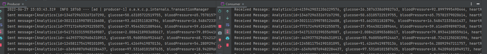

<div id="top"></div>
<!-- PROJECT SHIELDS -->


<br />
<div align="center">

<h1 align="center">Event driven architecture communication</h1>

  <p align="center">
    This project aims to provide an event driven architecture communication system using Kafka.
  </p>
</div>

<!-- ABOUT THE PROJECT -->

## About The Project

This project is a simple event driven architecture communication system using Kafka.
It is mainly used for testing purposes.

<br><br>Services:

- **Producer**: Publishes analytics events to Kafka.
- **Consumer**: Consumes analytics events from Kafka.

<p align="right">(<a href="#top">back to top</a>)</p>

## Scheduled tasks

A task is executed periodically to publish events to Kafka.


<p align="right">(<a href="#top">back to top</a>)</p>

## Built with

- **Java**
- **Spring**
- **Kafka**
- **Swagger**
- **Apache Maven**
- **Apache Kafka**

<p align="right">(<a href="#top">back to top</a>)</p>

## Getting Started

### Prerequisites

- Java 17
- Maven
- Docker

### Installation

To get a local copy up and running (inside docker folder):

```
docker-compose up -d
```

Run Producer and Consumer.

<p align="right">(<a href="#top">back to top</a>)</p>